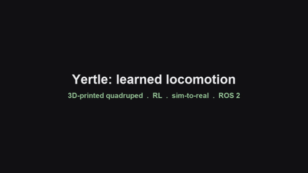
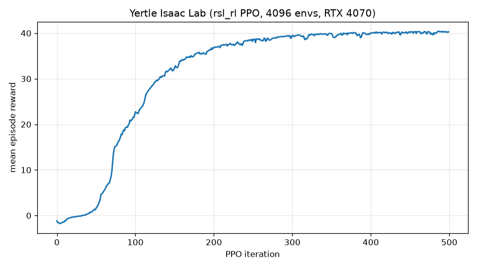

# A 3D Printed Quadrupedal Robot for Locomotion Research

<p align="center" >
 
 
 
 
 
</p>

<p align="center"><b>From a hand-tuned gait to reinforcement-learned locomotion: trained on CPU (PyBullet) and GPU (Isaac Lab), deployed via a sim-to-real bridge and ROS 2.</b></p>

<p align="center">

</p>

<br>
The robot consists of:

* 4 limbs with 3 degrees of freedom powered by hobby servos, with a leg extension of approximately 20cm.
* A 5000mah battery - 30 minutes of run time (optional). 
* A 9-axis accelerometer/gyro sensor. (optional)
* A current and voltage sensor. (optional)
* A microcontroller (ESP32s) to communicate with Hardware and sensors.
* A single-board computer (RPi4) to compute image, location, ROS and advanced controller algorithms. (optional)
* 1.8 kg

<br>
This robot was inspired by the <a href="https://grabcad.com/library/diy-quadruped-robot-1">Kangal</a>, <a href="https://spotmicroai.readthedocs.io/en/latest/">SpotMicro</a> and <a href="https://github.com/adham-elarabawy/open-quadruped">Open Quadruped</a>. The concept was to have the best parts of all designs and make it compatible with <a href="https://spotmicroai.readthedocs.io/en/latest/">SpotMicro</a> parts.
The current cost of the robot is around £250.
</br>


- - -

<br>

## Robot in action:


- - -

<br>

## Design:
Click [here](Design/README.md) for 3D printer parts, assembly instructions and bill of materials.
<br><br>
Yertle is a  fusion of the leg design of <a href="https://grabcad.com/library/diy-quadruped-robot-1">Kangal</a> and the body of <a href="https://spotmicroai.readthedocs.io/en/latest/">SpotMicro</a>. As such, you can use the control software and electronics from any Kangal or derivative with this robot (with a little modification). Any Modifications for the spot micro shell will also work with this robot. And You can exchange the legs for Kangal's if you want. 
<br>
<br>
I have built a few quadruped robots and there are plenty of interesting leg mechanics to choose from. Overall The Kangal legs do have limitations. Such as their limited range in motion. But they do have the benefit of being extremely light and easy to change. This means I'm not pulling up anything heavy when I'm lifting my leg allowing the servos to be slightly faster when not under load. And I'm less worried about breaking them or putting the robot in a more extreme environment.
<br>


<br>


- - - 
<br>

## Electronics:
Click [here](Design/README.md/#electronics) for an electronics and wiring explanation.
<br><br>
I'm currently working on a better description of my wiring. I have soldered a custom Hat from my RPi that had all the necessary components. The robot was originally designed to use just the RPi but I found it to be unreliable as it is more complex to reset the device and more prone to corruption. As The ESP32 has WiFi I can debug the device remotely without a complex startup/shut down routine.
<br><br>
If you are familiar with wiring  <a href="https://grabcad.com/library/diy-quadruped-robot-1">Kangal</a> and the body of <a href="https://spotmicroai.readthedocs.io/en/latest/">SpotMicro</a>. You can use the same wiring.

- - -
<br>


## Software:
Click [here](Software/README.md) for the software.
<br><br>
The software runs as a host/robot pair over the serial port or UDP over WiFi. The robot firmware controls all sensors and servos, computes the inverse kinematics and applies safety limits. The host side is written in Python 3: it takes the robot's sensor data, generates the motion (the hand-tuned gait in the GUI, or a learned policy from the RL pipelines) and streams it back in real time.
<br><br>
The firmware was written in C++ using Arduino IDE so you can modify it to work on a different microcontroller if you want. 
The Python Control software uses a GUI and can run on anything that has WiFi, a screen and can run Python3, including android devices(not tested).
<br><br>
There is also a ROS 2 package that runs a trained policy as a node, with a closed-loop demo and an Isaac Sim bridge; see [ros2/README.md](ros2/README.md).

- - -
<br>

## Simulation:
Click [here](Simulation/README.md) for simulation tools.<br><br>
There is a simulation built into the python software. It enables you to test movement with the controller without a robot. 
<br><br>


<br><br>

Here is another simulation example from Carter James using Unity.
<br><br> 
[](https://www.youtube.com/watch?v=7LgCC4D3Wlk)
- - -
<br>

## Learned locomotion (reinforcement learning):
Click [here](learning/README.md) for the RL locomotion pipeline.<br><br>
Alongside the hand-tuned sinusoidal gait, Yertle now has a reinforcement-learning
environment for training a walking policy in simulation and transferring it to
the physical robot. It wraps the same URDF in a Gymnasium environment
(PyBullet backend), trains with PPO, and uses domain randomisation (mass,
friction, sensor noise, pushes) to close the sim-to-real gap. The trained
policy outputs joint targets on the existing UDP command path, so no firmware
change is needed to deploy it.

```bash
pip install -r requirements.txt -r learning/requirements-rl.txt
python -m learning.smoke_test          # check the environment
python -m learning.train --timesteps 3000000 --n-envs 8
```

- - -
<br>

## GPU locomotion with NVIDIA Isaac Lab:
Click [here](isaac_lab/README.md) for the Isaac Lab pipeline.<br><br>
The same robot is also trained on **NVIDIA Isaac Lab** (Isaac Sim 5.1 + PhysX),
the industry-standard stack for legged-robot RL. The URDF (with firmware joint
limits and actuator caps) is converted to USD and dropped into Isaac Lab's
velocity-tracking locomotion task, then trained with `rsl_rl` PPO across
**4096 parallel environments** on a single RTX GPU. A walking policy converges
in about ten minutes (~80,000 simulation steps per second). The pipeline also
includes a **rough-terrain task** (procedural terrain plus a height scanner) and
**teacher-student distillation** that removes the privileged base-velocity
observation with no loss of performance, giving a policy that runs from
on-board sensors only.

<p align="center">

<br>

</p>

```bash
# in the Isaac Sim python env, from the repo root
python isaac_lab/train.py --task flat --headless --num_envs 4096 --max_iterations 1500
python isaac_lab/train.py --task rough --headless --num_envs 4096 --max_iterations 1000
python isaac_lab/play.py --task flat --checkpoint <model.pt> --num_envs 16 --video
python isaac_lab/distill.py --headless --teacher <model.pt>
```

- - -
<br>

## Repository structure

```
Design/        3D-printed parts, assembly guide and bill of materials
Simulation/    URDF model (valid inertials, firmware joint limits) and meshes
Software/
    ESP32/     Robot firmware (C++, Arduino / FreeRTOS)
    YertleUI/  Python control GUI: IK, PID balance, gait, PyBullet simulation
learning/      RL locomotion, CPU (Gymnasium + PyBullet + PPO) and sim-to-real bridge
isaac_lab/     RL locomotion, GPU (Isaac Lab + rsl_rl): flat, rough terrain,
               distillation, Isaac ROS 2 bridge
ros2/          ROS 2 package + closed-loop demo for a trained policy
paper/         Technical report (LaTeX; built PDF included)
media/         Demo montage video and GIF
requirements.txt, pyproject.toml   Python dependencies
```

- - -
<br>

## Getting started (control software)

Requires Python 3.9 or newer.

```bash
git clone https://github.com/Jerome-Graves/yertle.git
cd yertle
pip install -r requirements.txt
python Software/YertleUI/YertleUI.py
```

On Debian/Ubuntu, tkinter is a separate system package: `sudo apt install python3-tk`.

You do not need the physical robot to try it. Launch the GUI, press **Start Simulation** to open the PyBullet digital twin, then drive it with the arrow keys.

**Building the firmware:** open `Software/ESP32/firmware/firmware.ino` in the Arduino IDE with the ESP32 board package installed, along with the `FaBoPWM_PCA9685` and `MPU9250` libraries. WiFi credentials and IP addresses are set near the top of `yertle_lib.cpp`.

- - -
<br>

## Technical report

A six-page write-up of the whole project (system, both RL pipelines, results on
flat and rough terrain, distillation, deployment and ROS 2 integration, and the
engineering lessons) is in [paper/yertle_report.pdf](paper/yertle_report.pdf).

- - -
<br>

## To Do

*  Deploy the distilled policy to the physical robot and close the sim-to-real loop
*  Identify a stable measured actuator model from bench data
